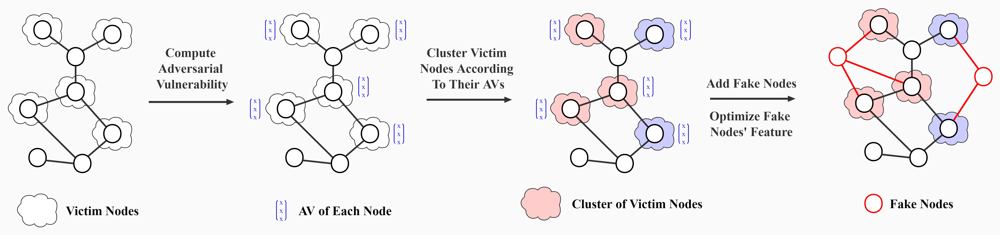

# Cluster Attack

The official implementation of paper [Cluster Attack: Query-based Adversarial Attacks on Graphs with Graph-Dependent Priors](https://arxiv.org/abs/2109.13069) (IJCAI 2022 **Long Presentation**).



## Usage

To run Cluster Attack on discrete feature space with default hyper-parameters

```
python main.py
```

To run Cluster Attack on continuous feature space with default hyper-parameters

```
python main_concrete.py
```

## Datasets

Two tiny citation networks (Cora and Citeseer) are included in our code.

Reddit dataset: https://github.com/matenure/FastGCN/issues/8#issuecomment-452463374 (from FastGCN, a preprocessed version) or http://snap.stanford.edu/graphsage/ (from SNAP, original).

ogbn-arxiv dataset: https://snap.stanford.edu/ogb/data/nodeproppred/arxiv.zip

We provide checkpoints of GCN model on Reddit and ogbn-arxiv datasets.

## Citation

If you find Cluster Attack helpful, please cite our paper.

```
@inproceedings{
    wang2022cluster,
    title={Cluster Attack: Query-based Adversarial Attacks on Graphs with Graph-Dependent Priors},
    author={Wang, Zhengyi and Hao, Zhongkai and Wang, Ziqiao and Su, Hang and Zhu, Jun},
    booktitle={International Joint Conference on Artificial Intelligence},
    year={2022},
    url={https://arxiv.org/abs/2109.13069}
}
```

## Reference

This implementation is based on the following repos:

- [TDGIA](https://github.com/THUDM/tdgia)
- [GraphSAGE](https://github.com/williamleif/graphsage-simple)
